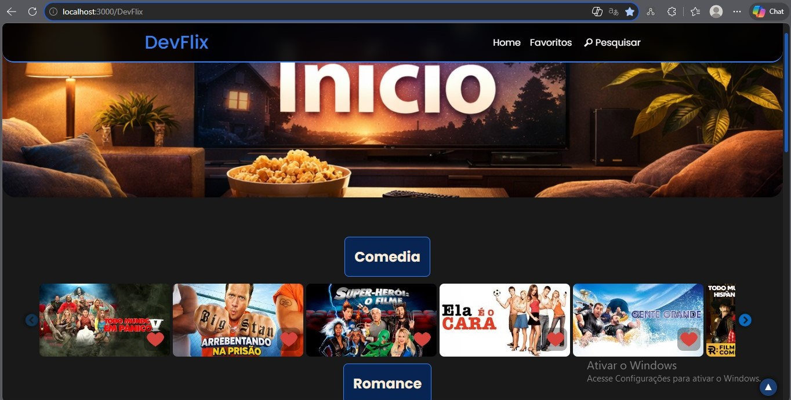
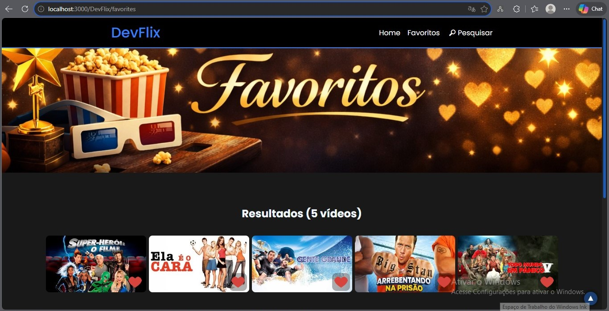
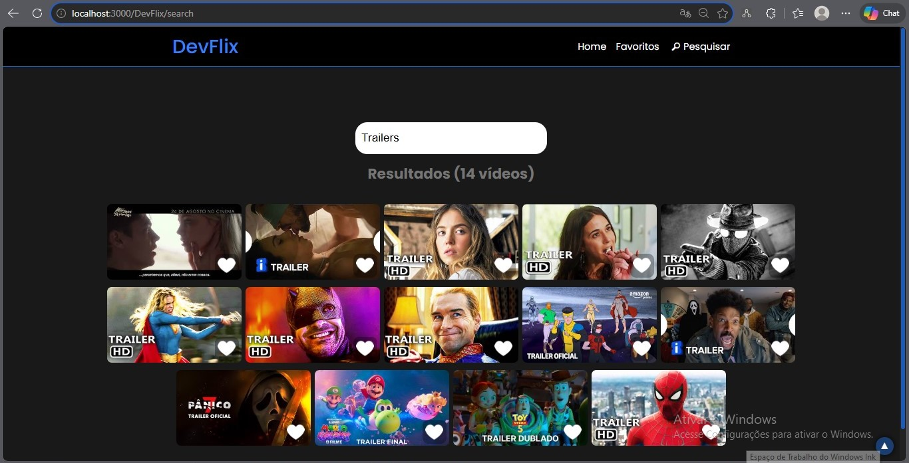
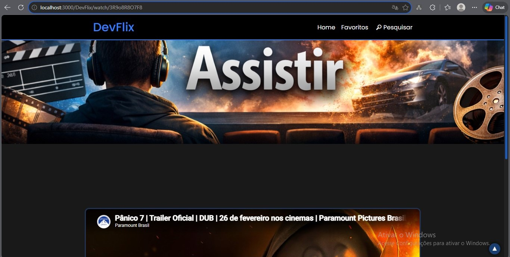
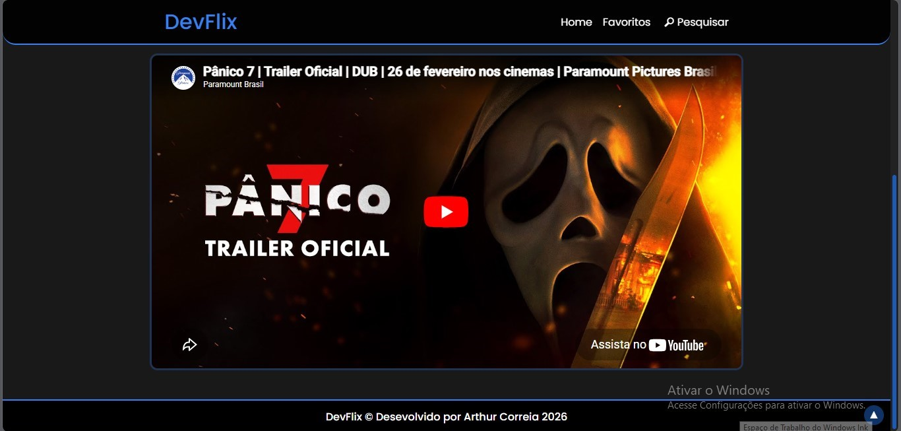

# 🎬 DevFlix

Projeto desenvolvido durante meus estudos em React.js, inspirado em plataformas de streaming como Netflix.

---

## 🚀 Acesse o projeto

🔵 GitHub Pages:  
https://arthur-correia18.github.io/DevFlix

---

## 📸 Preview

### 🏠 Home

  

---

### ⭐ Favoritos

  

---

### 🔎 Pesquisar

  

---

### 🎥 Assistir

  
  

---

## ⚙️ Funcionalidades

- 🎬 Listagem de vídeos por categorias  
- ⭐ Sistema de favoritos (salvo no navegador)  
- 🔎 Barra de pesquisa  
- 🎠 Carrossel interativo  
- 📱 Layout responsivo (mobile-first)  
- 🎥 Página de exibição de vídeos  
- 🔝 Botão de voltar ao topo  

---

## 🛠️ Tecnologias utilizadas

- React.js  
- JavaScript  
- CSS Modules  
- React Router DOM  

---

## 📚 Aprendizados

Durante esse projeto, desenvolvi conhecimentos em:

- Componentização com React  
- Uso de props e hooks  
- Gerenciamento de estado  
- Organização de pastas e boas práticas  
- Responsividade com CSS  
- Deploy com GitHub Pages e Vercel  

---

## 👨‍💻 Autor

Desenvolvido por **Arthur Correia**

🔗 GitHub: https://github.com/Arthur-Correia18  

---

## 📝 Licença

Este projeto está sob a licença MIT.
